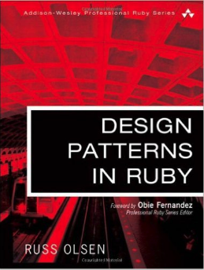

# eBook Design Patterns in Ruby

**About**

Explores how traditional software design patterns can be effectively implemented in Ruby, a dynamic programming language. 

[Homepage](http://designpatternsinruby.com/)

**Contents**

+ [Chapter 01: Building Better Programs with Patterns](contents/chapter-01-building-better-programs-with-patterns.md)
+ [Chapter 02: Getting Started with Ruby](contents/chapter-02-getting-started-with-ruby.md)
+ [Chapter 03: Varying the Algorithm with the Template Method](contents/chapter-03-varying-the-algorithm-with-the-template-method.md)
+ [Chapter 04: Replacing the Algorithm with the Strategy](contents/chapter-04-replacing-the-algorithm-with-the-strategy.md)
+ [Chapter 05: Keeping Up with the Times with the Observer](contents/chapter-05-keeping-up-with-the-times-with-the-observer.md)
+ [Chapter 06: Assembling the Whole from the Parts with the Composite](contents/chapter-06-assembling-the-whole-from-the-parts-with-the-composite.md)
+ [Chapter 07: Reaching into a Collection with the Iterator](contents/chapter-07-reaching-into-a-collection-with-the-iterator.md)
+ [Chapter 08: Getting Things Done with Commands](contents/chapter-08-getting-things-done-with-commands.md)
- [Chapter 09: Filling in the Gaps with the Adapter](contents/chapter-09-filling-in-the-gaps-with-the-adapter.md)
- [Chapter 10: Getting in Front of Your Object with a Proxy](contents/chapter-10-getting-in-front-of-your-object-with-a-proxy.md)
- [Chapter 11: Improving Your Objects with a Decorator](contents/chapter-11-improving-your-objects-with-a-decorator.md)
- [Chapter 12: Making Sure There Is Only One with the Singleton](contents/chapter-12-making-sure-there-is-only-one-with-the-singleton.md)
- [Chapter 13: Picking the Right Class with a Factory](contents/chapter-13-picking-the-right-class-with-a-factory.md)
- [Chapter 14: Easier Object Construction with the Builder](contents/chapter-14-easier-object-construction-with-the-builder.md)
- [Chapter 15: Assembling Your System with the Interpreter](contents/chapter-15-assembling-your-system-with-the-interpreter.md)
- [Chapter 16: Opening Up Your System with Domain-Specific Languages](contents/chapter-16-opening-up-your-system-with-domain-specific-languages.md)
- [Chapter 17: Creating Custom Objects with Meta-programming](contents/chapter-17-creating-custom-objects-with-meta-programming.md)
- [Chapter 18: Convention Over Configuration](contents/chapter-18-convention-over-configuration.md)
- [Chapter 19: Conclusion](contents/chapter-19-conclusion.md)
