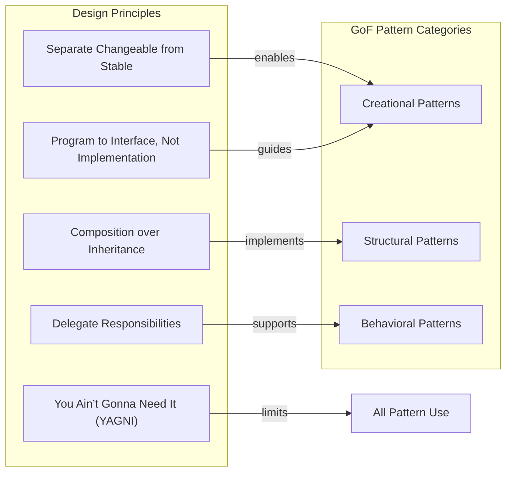

**Summary**

The first chapter introduces the core motivations behind using software design patterns and outlines how Ruby’s dynamic nature complements these patterns. It covers fundamental principles—separating what changes from what stays the same, programming to interfaces, favoring composition over inheritance, delegation, and avoiding unnecessary generalization (YAGNI). The chapter also presents the original "Gang of Four" (GoF) patterns and discusses how they can be effectively applied in Ruby.

**Concepts Map**

**Key Concepts**

* **Separate Changeable from Stable** Splitting parts of a system that change frequently from those that remain constant to isolate variability.
* **Program to Interface, Not Implementation** Relying on abstract interfaces or contracts rather than specific concrete classes.
* **Composition over Inheritance** Building functionality by combining objects rather than extending classes.
* **Delegate Responsibilities** Assigning tasks to helper objects or methods to maintain single responsibility.
* **YAGNI (You Ain’t Gonna Need It)** Avoiding adding features until they are necessary to reduce complexity.
* **Gang of Four (GoF)** The group of authors who cataloged 23 classic design patterns in object-oriented design.

**Quiz 20250622_12:00:00**

1. What is the main benefit of separating changeable parts from stable parts in a system?
- a) Improved runtime performance
- b) Easier maintenance and evolution
- c) Reduced memory usage
- d) Simpler user interface

2. Programming to an interface rather than an implementation helps to:
- a) Increase coupling
- b) Reduce flexibility
- c) Improve testability and modularity
- d) Limit reuse

3. Which principle emphasizes using objects together instead of relying on class hierarchies?
- a) YAGNI
- b) Composition over inheritance
- c) Delegation
- d) Singleton pattern

4. Delegation in Ruby is often achieved using:
- a) Inheritance
- b) Modules including
- c) Method missing or forwarding methods
- d) Global variables

5. The YAGNI principle stands for:
- a) You Always Gain New Ideas
- b) You Always Get New Instances
- c) You Ain’t Gonna Need It
- d) Your Application Generates No Issues

6. Who are the “Gang of Four”?
- a) A set of four Ruby gems
- b) Authors of the original GoF design patterns book
- c) Members of the Rails core team
- d) Four recommended Ruby style guides

7. Creational patterns focus on:
- a) Structuring classes and objects
- b) Defining how objects are created
- c) Communicating between classes
- d) Enforcing coding standards

8. Which of these is a structural pattern category?
- a) Adapter
- b) Strategy
- c) Observer
- d) Template Method

9. Favoring composition over inheritance helps to:
- a) Increase class hierarchy depth
- b) Boost coupling between classes
- c) Enhance flexibility and reuse
- d) Eliminate the need for interfaces

10. Delegation can support which category of GoF patterns most directly?
- a) Behavioral patterns
- b) Creational patterns
- c) Structural patterns
- d) All of the above

**Answers:**
1. b) Easier maintenance and evolution — isolating variability simplifies updates.
2. c) Improve testability and modularity — interfaces decouple implementation details.
3. b) Composition over inheritance — builds behavior by combining objects.
4. c) Method missing or forwarding methods — Ruby uses delegation via dynamic method calls.
5. c) You Ain’t Gonna Need It — avoid premature generalization.
6. b) Authors of the original GoF design patterns book — Erich Gamma et al.
7. b) Defining how objects are created — patterns like Factory and Singleton.
8. a) Adapter — it’s a pattern that deals with object composition and structure.
9. c) Enhance flexibility and reuse — composition allows swapping parts at runtime.
10. a) Behavioral patterns — delegation often implements behavior delegation.

**Challenge**

Refactor a simple Ruby logging system that uses inheritance for message formatting into a design using composition and delegation. Provide a high-level outline (class/module names and interactions) and explain how this approach improves flexibility and maintainability.

**Challenge Answer:**
Use a `Formatter` module with multiple concrete formatter classes (e.g., `JsonFormatter`, `PlainFormatter`) and a `Logger` class that holds a reference to a formatter object. The `Logger` delegates the `format(message)` call to the injected formatter. This allows swapping formatters at runtime, adding new formats without modifying `Logger`, and simplifies testing by mocking the formatter interface.