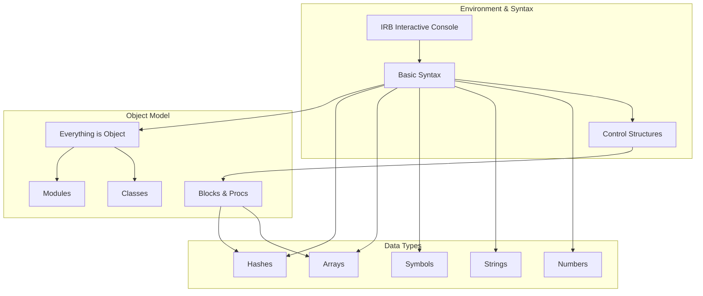

**Summary**

This chapter introduces Ruby’s core language features and interactive environment. It covers using IRB for experimentation, basic syntax (variables, data types, control structures), fundamental object model concepts (everything is an object, classes, modules), and Ruby’s powerful collections and blocks. Readers learn how to write simple programs, define classes, and leverage Ruby’s dynamic features.

**Concepts Map**



**Key Concepts**

* **IRB** The interactive Ruby shell for live experimentation and testing.
* **Everything is an Object** In Ruby, primitive values and data structures are objects with methods.
* **Variables and Types** Dynamically typed variables hold references to objects (Fixnum, String, Array, etc.).
* **Control Structures** Conditional (`if`, `case`) and looping (`while`, `for`, `each`) constructs.
* **Blocks & Procs** Anonymous functions or closures that can be passed to methods like `each`.
* **Classes & Modules** Defining behavior with classes and sharing functionality with modules (`include`).
* **Collections** Arrays and Hashes for grouping and accessing multiple objects.

**Quiz 20250622_12:30:00**

1. What command starts an interactive Ruby session?
- a) ruby run
- b) irb
- c) ruby -i
- d) pry

2. Which class represents an immutable string identifier in Ruby?
- a) String
- b) Symbol
- c) Text
- d) Identifier

3. How do you define a block parameter in a method call?
- a) with `{ }` or `do...end`
- b) with `fn => end`
- c) with `[ ]`
- d) with `( )`

4. Everything in Ruby is:
- a) A primitive
- b) A module
- c) An object
- d) A class

5. Which collection type uses key–value pairs?
- a) Array
- b) Hash
- c) Set
- d) List

6. To share behavior across classes without inheritance, you use:
- a) mixin
- b) subclassing
- c) global variables
- d) class variables

7. Which control structure is best for selecting among multiple conditions?
- a) if
- b) while
- c) case
- d) for

8. A `Proc` object represents:
- a) A data container
- b) A callable block of code
- c) A constant
- d) A class definition

9. Which method iterates over each element in an array?
- a) map
- b) each
- c) for
- d) select

10. To define a new class in Ruby, you use:
- a) define ClassName
- b) class ClassName
- c) module ClassName
- d) new ClassName

**Answers:**
1. b) irb — starts Interactive Ruby Shell.
2. b) Symbol — immutable identifier objects.
3. a) with `{ }` or `do...end` — Ruby block syntax.
4. c) An object — Ruby is pure object-oriented.
5. b) Hash — key–value collection.
6. a) mixin — include modules.
7. c) case — handles multiple branches.
8. b) A callable block of code — Proc wraps a block.
9. b) each — standard iterator method.
10. b) class ClassName — defines a class.

**Challenge**

Write a Ruby script defining a `Book` class with attributes `title` and `author`. Use an array of book instances and implement a method that yields each book to a block for custom printing. Show how a block can customize output format.

**Challenge Answer:**
```ruby
class Book
  attr_reader :title, :author
  def initialize(title, author)
    @title = title
    @author = author
  end
end

books = [Book.new('Eloquent Ruby', 'Russ Olsen'), Book.new('Practical Object-Oriented Design', 'Sandi Metz')]

def print_books(books)
  books.each { |book| yield(book) }
end

# Usage:
print_books(books) do |b|
  puts "Title: #{b.title.upcase}, Author: #{b.author}"
end
```