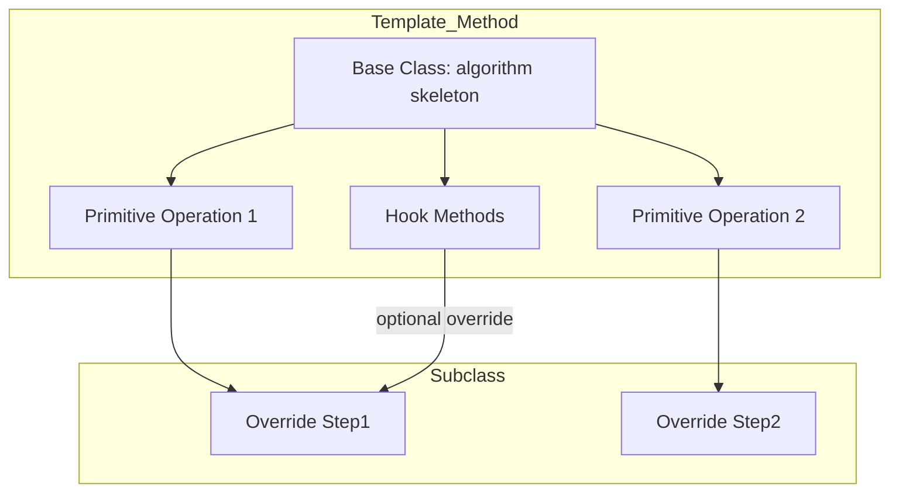

**Summary**

Chapter 3 explores the Template Method pattern, which defines the skeleton of an algorithm in a base class and allows subclasses to override specific steps. It shows how Ruby’s subclassing and hooks simplify implementing templates and encourages using tests to verify correctness.

**Concepts Map**



**Key Concepts**

* **Template Method** Defines an overall algorithm structure in a superclass.
* **Primitive Operations** Steps in the algorithm that subclasses provide.
* **Hook Methods** Optional extension points that subclasses can override.
* **Inversion of Control** Parent class controls flow; children fill in details.
* **Testing Templates** Unit tests confirm each step and overall behavior.

**Quiz 20250622_13:00:00**

1. The Template Method pattern primarily focuses on:
- a) Object creation
- b) Algorithm structure
- c) Interface definition
- d) Resource cleanup

2. Primitive operations in Template Method are:
- a) Methods directly called by clients
- b) Steps intended for subclass override
- c) Private helper methods
- d) Callback hooks only

3. Hook methods differ from primitive operations because they are:
- a) Mandatory overrides
- b) Optional extension points
- c) Called twice per execution
- d) Defined in modules only

4. Which Ruby feature simplifies hook implementation?
- a) alias_method
- b) method_missing
- c) blocks
- d) default parameter values

5. Inversion of Control in Template Method means:
- a) Subclass dictates entire flow
- b) Superclass dictates flow, subclasses provide details
- c) Control returns to caller midway
- d) Modules handle control logic

6. To test a Template Method, you should:
- a) Only test base class
- b) Only test subclasses
- c) Test both base and overridden steps
- d) Skip tests for hooks

7. A common Ruby idiom for template steps is:
- a) Procs stored in constants
- b) private methods named with underscore
- c) public methods called by clients
- d) class variables tracking state

8. Template Method helps to:
- a) Eliminate inheritance
- b) Standardize algorithm framework
- c) Replace all design patterns
- d) Facilitate singleton use

9. A violation of Template Method occurs when:
- a) Subclasses redefine entire algorithm
- b) Subclasses override only needed methods
- c) Base class has no algorithm
- d) Algorithm is too simple

10. Which test ensures the overall template works?
- a) Unit test of each primitive step
- b) Integration test of full algorithm
- c) Mock test of base class
- d) No test needed

**Answers:**
1. b) Algorithm structure — defines skeleton of an algorithm.
2. b) Steps intended for subclass override — primitives are customizable.
3. b) Optional extension points — hooks can be overridden but not required.
4. a) alias_method — Ruby can alias and wrap methods for hooks.
5. b) Superclass dictates flow, subclasses provide details — IoC inverted.
6. c) Test both base and overridden steps — ensure correctness at each level.
7. b) private methods named with underscore — convention for internal steps.
8. b) Standardize algorithm framework — template establishes structure.
9. a) Subclasses redefine entire algorithm — violates single-responsibility.
10. b) Integration test of full algorithm — verifies end-to-end flow.

**Challenge**

Implement a report generator base class that defines `generate_report` steps (load data, format, output) and create two subclasses for HTML and JSON output. Show class definitions and explain how Template Method enforces consistency.

**Challenge Answer:**
```ruby
class ReportGenerator
  def generate_report
    data = load_data
    formatted = format_data(data)
    output(formatted)
  end
  # abstract methods
  def load_data; raise NotImplementedError; end
  def format_data(data); raise NotImplementedError; end
  def output(content); raise NotImplementedError; end
end

class HtmlReport < ReportGenerator
  def load_data; {...} end
  def format_data(d); d.to_html end
  def output(c); File.write('report.html', c) end
end

class JsonReport < ReportGenerator
  def load_data; {...} end
  def format_data(d); JSON.pretty_generate(d) end
  def output(c); File.write('report.json', c) end
end
```
This ensures all reports follow `generate_report` steps in order while allowing subclass-specific behavior.