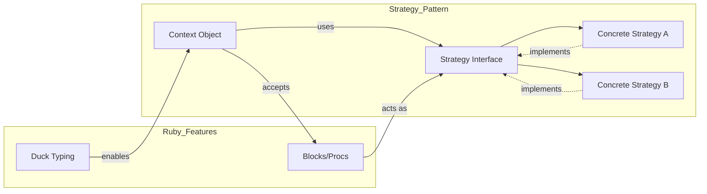

**Summary**

Chapter 4 covers the Strategy pattern, which encapsulates interchangeable algorithms as objects. It shows how Ruby’s first-class Procs, blocks, and duck typing simplify creating and swapping strategies at runtime, reducing coupling between context and algorithm.

**Concepts Map**



**Key Concepts**

* **Strategy Pattern** Encapsulate algorithms in separate classes or objects.
* **Context** Object that delegates behavior to a strategy.
* **Concrete Strategy** Specific implementation of the algorithm.
* **Duck Typing** Ruby’s dynamic typing allows any object responding to expected methods.
* **Blocks & Procs** Use closures as lightweight strategies.

**Quiz 20250622_13:30:00**

1. The Strategy pattern’s main goal is to:
- a) Centralize object creation
- b) Encapsulate interchangeable algorithms
- c) Define object structure
- d) Automate resource cleanup

2. In Ruby, a Proc can act as a:
- a) Context
- b) Block
- c) Strategy
- d) Subclass

3. The object that holds a strategy and delegates to it is called:
- a) Algorithm
- b) Client
- c) Context
- d) Singleton

4. Duck typing allows you to:
- a) Enforce strict interfaces
- b) Use any object with correct methods
- c) Prevent method_missing calls
- d) Avoid blocks entirely

5. To switch behavior at runtime, you:
- a) Reopen the class
- b) Assign a new strategy object
- c) Use class variables
- d) Change inheritance

6. A concrete strategy must implement:
- a) The context’s private methods
- b) A common interface or method signature
- c) The Template Method
- d) The Singleton initializer

7. Blocks differ from Procs in that blocks:
- a) Are objects
- b) Cannot be reused once passed
- c) Always return nil
- d) Do not support parameters

8. The Strategy pattern reduces coupling between:
- a) Strategy and context
- b) Context and client code
- c) Strategy and subclasses
- d) Objects and modules

9. A violation of the Strategy pattern is when:
- a) Context hard-codes algorithm in conditional
- b) Strategies are swapped dynamically
- c) Blocks are used as strategies
- d) Multiple strategies exist

10. Using Procs for strategies is beneficial because:
- a) They cannot capture state
- b) They are heavyweight classes
- c) They support closures and runtime binding
- d) They require explicit interface definitions

**Answers:**
1. b) Encapsulate interchangeable algorithms — separates algorithm from context.
2. c) Strategy — Proc implements expected call signature.
3. c) Context — delegates to strategy instance.
4. b) Use any object with correct methods — no formal interface needed.
5. b) Assign a new strategy object — switch implementation at runtime.
6. b) A common interface or method signature — respond to expected method.
7. b) Cannot be reused once passed — blocks are one-off, Procs are objects.
8. a) Strategy and context — decouples algorithm from host.
9. a) Context hard‐codes algorithm in conditional — violates encapsulation.
10. c) They support closures and runtime binding — carry state and behavior.

**Challenge**

Create a sorting context that accepts different comparison strategies (ascending, descending, custom) implemented as Procs. Show usage swapping strategies without changing sorting logic.

**Challenge Answer:**
```ruby
class Sorter
  def initialize(strategy)
    @strategy = strategy
  end
  def sort(data)
    data.sort(&@strategy)
  end
end

asc = ->(a, b) { a <=> b }
desc = ->(a, b) { b <=> a }

sorter = Sorter.new(asc)
puts sorter.sort([3,1,2]) # [1,2,3]

sorter = Sorter.new(desc)
puts sorter.sort([3,1,2]) # [3,2,1]
```