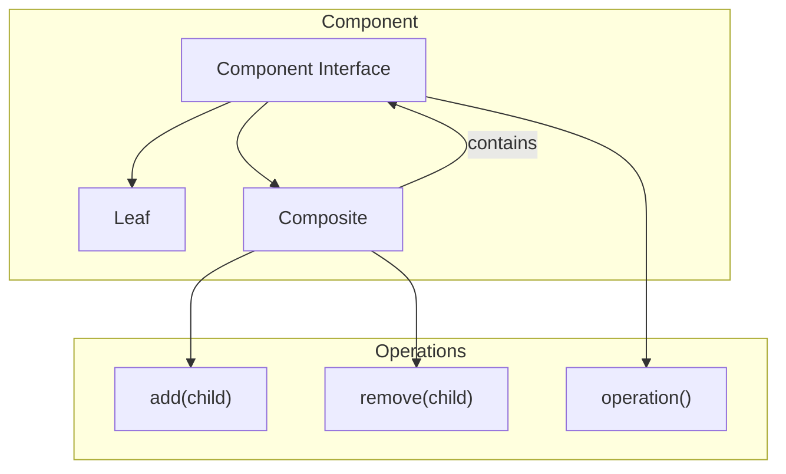

**Summary**

Chapter 6 introduces the Composite pattern, which lets clients treat individual objects and compositions uniformly. It demonstrates building tree structures of objects with a common interface, using recursive algorithms to traverse and operate on both leaves and composites.

**Concepts Map**



**Key Concepts**

* **Component Interface** Declares operations for both leaves and composites.
* **Leaf** Represents end objects of a composition—no children.
* **Composite** Holds child components and implements operations by delegating to children.
* **Uniformity** Clients interact with components without distinguishing leaves from composites.
* **Recursive Traversal** Composite operations iterate through subcomponents.

**Quiz 20250622_15:00:00**

1. The Composite pattern lets you treat:
- a) Classes and modules uniformly
- b) Single objects and compositions uniformly
- c) Methods and functions the same
- d) Data and code equally

2. In Composite, a leaf object:
- a) Contains children
- b) Implements operation without children
- c) Delegates to composites
- d) Defines interface only

3. Composite stores child components in:
- a) A constant
- b) A collection (e.g., array)
- c) Class variable
- d) Global variable

4. Recursive traversal in Composite is needed to:
- a) Build classes dynamically
- b) Navigate tree structures
- c) Initialize modules
- d) Register observers

5. Clients interact with components via:
- a) Concrete classes directly
- b) Component interface
- c) Factory objects
- d) Strategy objects

6. Removing a child from Composite uses:
- a) delete method
- b) remove(child) method
- c) detach hook
- d) unsubscribe

7. Composite pattern promotes:
- a) Deep inheritance hierarchies
- b) High coupling
- c) Tree-structured object graphs
- d) Resource pooling

8. A violation of Composite occurs if:
- a) Leaves contain children
- b) Composite has no children
- c) Interface defines no operations
- d) Recursive call is missing

9. Composite is often used to represent:
- a) Formatting strategies
- b) File system directories and files
- c) Logging levels
- d) Dependency injection

10. Composite simplifies client code by:
- a) Removing need for loops
- b) Unifying handling of single and composite objects
- c) Eliminating classes
- d) Inlining algorithms

**Answers:**
1. b) Single objects and compositions uniformly — uniform interface.
2. b) Implements operation without children — leaf has no subcomponents.
3. b) A collection (e.g., array) — holds child components.
4. b) Navigate tree structures — recursive traversal.
5. b) Component interface — clients call interface methods.
6. b) remove(child) method — remove child.
7. c) Tree-structured object graphs — composite creates trees.
8. a) Leaves contain children — violates leaf semantics.
9. b) File system directories and files — classic example.
10. b) Unifying handling of single and composite objects — simplifies code.

**Challenge**

Design a menu system where each menu item can be a single command or a submenu (composite). Outline class definitions and demonstrate executing an `execute` operation that runs commands or delegates into submenus.

**Challenge Answer:**
```ruby
class MenuComponent
  def execute; raise NotImplementedError; end
end
class MenuItem < MenuComponent
  def initialize(action); @action = action; end
  def execute; @action.call; end
end
class Menu < MenuComponent
  def initialize; @items = []; end
  def add(component); @items << component; end
  def execute
    @items.each(&:execute)
  end
end

# Usage:
menu = Menu.new
menu.add(MenuItem.new(-> { puts 'Open' }))
submenu = Menu.new
submenu.add(MenuItem.new(-> { puts 'Save' }))
menu.add(submenu)
menu.execute
```