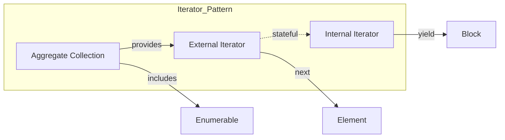

**Summary**

Chapter 7 explains the Iterator pattern, exploring internal and external iterators. It covers Ruby’s `Enumerable` module and how methods like `each`, `map`, and `inject` implement iteration, plus custom iterator creation.

**Concepts Map**



**Key Concepts**

* **External Iterator** Explicit iterator object controlled by client (`next`, `has_next`).
* **Internal Iterator** Control remains inside collection methods like `each`.
* **Enumerable Module** Provides a suite of traversal and searching methods when `each` exists.
* **Blocks** Used by internal iterators to execute code for each element.
* **Stateful vs. Stateless** External iterators maintain state; internal do not.

**Quiz 20250622_15:30:00**

1. An external iterator in Ruby is represented by:
- a) a block
- b) an Enumerator object
- c) a class method
- d) a module mixin

2. The `each` method is an example of:
- a) External iterator
- b) Internal iterator
- c) Both
- d) Neither

3. Including the `Enumerable` module requires defining:
- a) map
- b) each
- c) inject
- d) next

4. To get an external iterator for an array, you call:
- a) array.iterator
- b) array.each
- c) array.to_enum
- d) array.yield

5. Internal iterators differ by:
- a) returning the iterator object
- b) yielding control to a block
- c) needing manual state management
- d) being part of core library only

6. The `inject` method is used for:
- a) Filtering elements
- b) Accumulating values
- c) Iterating with side-effects
- d) Sorting

7. An Enumerator created with `to_enum` is:
- a) Stateless
- b) Stateful external iterator
- c) Module
- d) Block

8. You can pause and resume iteration using:
- a) `break`
- b) `next`
- c) `Fiber` with enumerators
- d) `return`

9. A violation of Iterator pattern is when:
- a) Collections implement `each`
- b) Clients index directly into arrays
- c) Using `Enumerable`
- d) Using blocks

10. The benefit of `Enumerable` is:
- a) Reduces need to write loops
- b) Increases coupling
- c) Eliminates arrays
- d) Prevents recursion

**Answers:**
1. b) an Enumerator object — external iterator.
2. b) Internal iterator — `each` yields to block.
3. b) each — required by `Enumerable`.
4. c) array.to_enum — returns Enumerator.
5. b) yielding control to a block — internal iterator behavior.
6. b) Accumulating values — inject/fold.
7. b) Stateful external iterator — tracks position.
8. c) `Fiber` with enumerators — pause/resume.
9. b) Clients index directly into arrays — bypasses iteration.
10. a) Reduces need to write loops — collection methods simplify code.

**Challenge**

Implement a custom collection class `PrimeCollection` that yields prime numbers up to a limit using an Enumerator. Demonstrate both external and internal iteration.

**Challenge Answer:**
```ruby
class PrimeCollection
  include Enumerable
  def initialize(limit); @limit = limit; end
  def each
    num = 2
    while num <= @limit
      yield num if prime?(num)
      num += 1
    end
  end
  private
  def prime?(n)
    (2...n).none? { |i| n % i == 0 }
  end
end

primes = PrimeCollection.new(10)
# internal
primes.each { |p| puts p }
# external
enum = primes.to_enum
while (value = enum.next) rescue break
  puts value
end
```