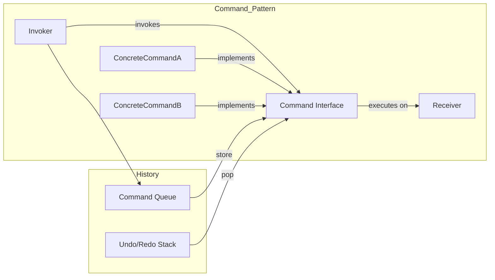

**Summary**

Chapter 8 explores the Command pattern, encapsulating requests as objects to parameterize, queue, and support undo/redo operations. It demonstrates Ruby’s use of blocks and objects to represent commands and how to record and replay actions.

**Concepts Map**



**Key Concepts**

* **Command** Encapsulates a request as an object with an `execute` method.
* **Invoker** Object that triggers commands.
* **Receiver** The object that performs the actual work.
* **Macro Commands & Queues** Store sequences of commands for later execution.
* **Undo/Redo** Commands record state to support reversal.
* **Blocks as Commands** Use Proc or lambda for lightweight commands.

**Quiz 20250622_16:00:00**

1. The Command pattern’s main benefit is:
- a) Replacing inheritance
- b) Encapsulating actions as objects
- c) Implementing algorithms
- d) Structuring data

2. In Ruby, a simple command can be a:
- a) Class variable
- b) Proc or lambda
- c) Module
- d) Constant

3. The invoker in Command pattern:
- a) Creates the receiver
- b) Calls `execute` on commands
- c) Stores object state
- d) Defines new commands

4. Undo functionality requires commands to:
- a) include a `redo` method
- b) track state changes for reversal
- c) modify the invoker
- d) queue themselves infinitely

5. Macro commands are:
- a) Single-purpose commands
- b) Commands that call other commands
- c) Deprecated in Ruby
- d) Handled by Template Method

6. Command objects separate:
- a) UI from business logic
- b) data storage
- c) algorithm structure
- d) object creation

7. Receiver executes:
- a) `invoke` method
- b) `execute` method
- c) business logic
- d) command queue

8. A violation of Command pattern is when:
- a) Blocks are used
- b) Action code is embedded in UI event handler
- c) Commands are queued
- d) Receivers are separate

9. You can queue commands to:
- a) delay execution
- b) inline method calls
- c) remove dependencies
- d) prevent garbage collection

10. Blocks as commands are beneficial because:
- a) They enforce interfaces
- b) They carry state and code concisely
- c) They require class definitions
- d) They disable undo

**Answers:**
1. b) Encapsulating actions as objects — decouples requester and executor.
2. b) Proc or lambda — lightweight command representation.
3. b) Calls `execute` on commands — invoker triggers execution.
4. b) track state changes for reversal — undo requires state.
5. b) Commands that call other commands — macro executes list.
6. a) UI from business logic — separates concerns.
7. c) business logic — receiver performs work.
8. b) Action code is embedded in UI event handler — tight coupling.
9. a) delay execution — queue for later.
10. b) carry state and code concisely — closures pack context.

**Challenge**

Implement a text editor that records typing and delete actions as commands, supports undo and redo. Outline command classes, invoker storing history, and sample usage.

**Challenge Answer:**
```ruby
class TypingCommand
  def initialize(receiver, text); @rec, @text = receiver, text; end
  def execute; @rec.insert(@text); end
  def undo; @rec.delete(@text.length); end
end
class Editor
  attr_reader :buffer
  def initialize; @buffer = ''; @history = []; @redo_stack = []; end
  def execute(cmd)
    cmd.execute
    @history << cmd; @redo_stack.clear
  end
  def undo
    cmd = @history.pop; cmd.undo; @redo_stack << cmd if cmd
  end
  def redo
    cmd = @redo_stack.pop; execute(cmd) if cmd
  end
end

# Usage:
ed = Editor.new
tc = TypingCommand.new(ed,'Hello')
ed.execute(tc)
ed.undo
ed.redo
```