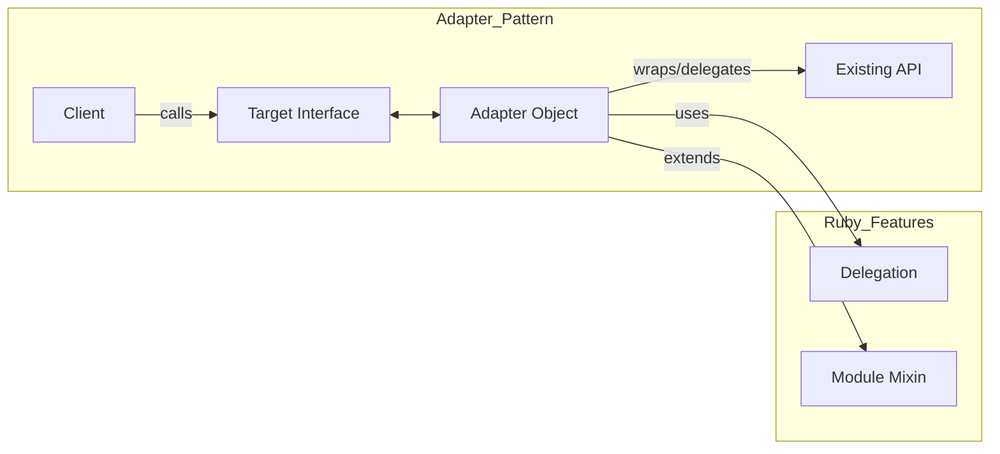

**Summary**

Chapter 9 covers the Adapter pattern, which allows incompatible interfaces to work together by wrapping an existing object with a new interface. It demonstrates object adapters in Ruby using delegation and modules, enabling clients to call a uniform API while leveraging legacy or third-party code.

**Concepts Map**



**Key Concepts**

* **Adapter** Wraps an object to match the target interface.
* **Target Interface** The interface clients expect.
* **Adaptee** The existing object with a mismatched interface.
* **Object Adapter** Uses composition/delegation rather than inheritance.
* **Class Adapter** (less common in Ruby) uses inheritance and monkey patching.
* **Decoupling** Enables reuse of legacy code without modifying it.

**Quiz 20250622_16:30:00**

1. The Adapter pattern is used to:
- a) Create new objects
- b) Convert one interface into another
- c) Structure class hierarchies
- d) Implement algorithms

2. In Ruby, an object adapter typically uses:
- a) Inheritance
- b) Delegation
- c) metaprogramming
- d) global variables

3. The existing API being adapted is called the:
- a) Target
- b) Adapter
- c) Adaptee
- d) Client

4. Clients interact with the adapter via the:
- a) Adaptee methods
- b) Target interface
- c) Adapter implementation
- d) Direct API calls

5. A class adapter differs from an object adapter by:
- a) using modules vs classes
- b) using inheritance vs delegation
- c) requiring monkey patching
- d) not wrapping objects

6. Decoupling in Adapter promotes:
- a) Tight coupling
- b) Loose coupling
- c) No coupling
- d) Circular dependencies

7. A violation of Adapter occurs when:
- a) You wrap the object correctly
- b) You modify the Adaptee source code
- c) You use delegation
- d) You define a target interface

8. Using modules in Adapter helps to:
- a) Remove inheritance
- b) Share adapter logic across classes
- c) Prevent delegation
- d) Hardcode method names

9. Adapter pattern is most beneficial when:
- a) Writing new code only
- b) Integrating with legacy/third-party code
- c) Designing algorithms
- d) Managing stateful objects

10. The core responsibility of Adapter is to:
- a) Create objects
- b) Adapt calls to an existing interface
- c) Store data
- d) Delete resources

**Answers:**
1. b) Convert one interface into another — core of Adapter.
2. b) Delegation — object adapter delegates calls.
3. c) Adaptee — existing incompatible interface.
4. b) Target interface — what clients use.
5. b) Inheritance vs delegation — class adapter inherits adaptor.
6. b) Loose coupling — wraps without modifying original.
7. b) You modify the Adaptee source code — breaks pattern.
8. b) Share adapter logic across classes — mixin behavior.
9. b) Integrating with legacy/third-party code — common use case.
10. b) Adapt calls to an existing interface — maps calls.

**Challenge**

Implement an adapter to integrate a legacy XML parser (with method `parse_xml(data)`) into a new JSON-based API expecting `parse(data)`. Show adapter class and usage in a client.

**Challenge Answer:**
```ruby
class XmlParser
  def parse_xml(data)
    # returns a Hash from XML string
  end
end

module ParserInterface
  def parse(data); raise NotImplementedError; end
end

class XmlToJsonAdapter
  include ParserInterface
  def initialize(xml_parser)
    @xml = xml_parser
  end
  def parse(data)
    @xml.parse_xml(data)
  end
end

# Client usage:
xml_parser = XmlParser.new
adapter = XmlToJsonAdapter.new(xml_parser)
result = adapter.parse('<root><item>1</item></root>')
```