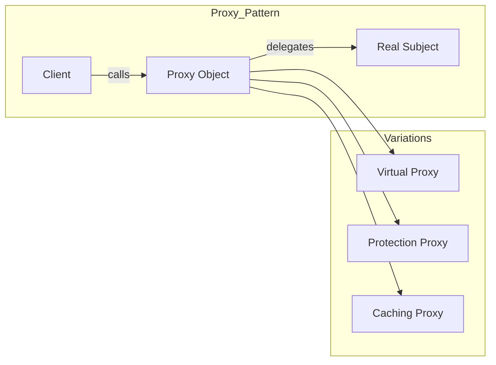

**Summary**

Chapter 10 examines the Proxy pattern, which provides a surrogate for another object to control access, add behavior, or defer instantiation. It shows Ruby’s dynamic features to implement virtual, protection, and caching proxies via delegation and method_missing.

**Concepts Map**



**Key Concepts**

* **Proxy** Offers an interface identical to the real subject.
* **Real Subject** The actual object performing work.
* **Virtual Proxy** Defers expensive instantiation until needed.
* **Protection Proxy** Controls access based on permissions.
* **Caching Proxy** Stores results to avoid repeated calls.
* **method_missing** Ruby hook to delegate undefined methods.

**Quiz 20250622_17:00:00**

1. The Proxy pattern’s main purpose is to:
- a) Create objects lazily
- b) Modify class inheritance
- c) Encapsulate algorithm steps
- d) Manage event listeners

2. A virtual proxy:
- a) Logs calls
- b) Delays creation of the real subject
- c) Enforces security
- d) Stores responses

3. Protection proxies restrict access by:
- a) Caching results
- b) Checking permissions before delegating
- c) Logging calls
- d) Using method_missing only

4. Caching proxy improves performance by:
- a) Instantiating objects eagerly
- b) Saving and reusing method results
- c) Blocking unauthorized calls
- d) Simplifying interface

5. In Ruby, to delegate unknown methods, you use:
- a) forward
- b) method_missing
- c) call_missing
- d) missing_method

6. Clients interact with the proxy via:
- a) A different interface
- b) The same interface as the subject
- c) Direct subject methods
- d) Global functions

7. A violation of Proxy is when:
- a) Proxy and subject share an interface
- b) Proxy adds behavior transparently
- c) Client must know about proxy implementation
- d) Subject handles security checks

8. Virtual proxy is useful for:
- a) Small, cheap objects
- b) Objects with heavy initialization
- c) Immutable data
- d) Logging only

9. A protection proxy often implements:
- a) Logging
- b) Authentication checks
- c) Data transformation
- d) Recursion

10. Caching proxy risks:
- a) Inconsistent data if underlying changes
- b) Performance degradation
- c) Eager loading
- d) Inheritance issues

**Answers:**
1. a) Create objects lazily — primary use of virtual proxy.
2. b) Delays creation of the real subject — lazy instantiation.
3. b) Checking permissions before delegating — protection.
4. b) Saving and reusing method results — caching behavior.
5. b) method_missing — intercepts undefined calls.
6. b) The same interface as the subject — transparency.
7. c) Client must know about proxy implementation — breaks transparency.
8. b) Objects with heavy initialization — delay overhead.
9. b) Authentication checks — typical protection use.
10. a) Inconsistent data if underlying changes — stale cache risk.

**Challenge**

Implement a caching proxy for a `DataFetcher` class whose `fetch` method makes HTTP calls. Show proxy class storing responses in a hash and delegating calls.

**Challenge Answer:**
```ruby
class DataFetcher
  def fetch(id); HTTP.get("/data/#{id}") end
end
class CachingProxy
  def initialize(fetcher); @fetcher = fetcher; @cache = {} end
  def fetch(id)
    @cache[id] ||= @fetcher.fetch(id)
  end
end

proxy = CachingProxy.new(DataFetcher.new)
proxy.fetch(1) # HTTP call
proxy.fetch(1) # cached
```