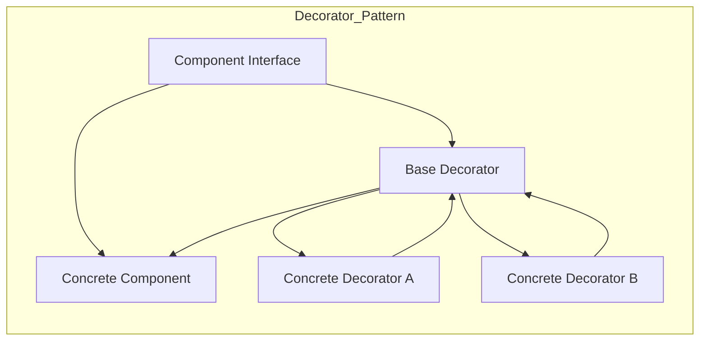

**Summary**

Chapter 11 demonstrates the Decorator pattern, allowing behavior to be added to individual objects dynamically by wrapping them with decorator classes. Ruby’s open classes and modules make creating decorators straightforward.

**Concepts Map**



**Key Concepts**

* **Decorator** Wraps a component to extend behavior without altering its structure.
* **Component Interface** Defines methods that concrete objects and decorators implement.
* **Concrete Decorator** Adds responsibility before or after delegating to wrapped object.
* **Chaining Decorators** Wrappers can be stacked to combine features.
* **Open Classes** Ruby allows reopening classes to add default decorator registration.

**Quiz 20250622_17:30:00**

1. The Decorator pattern’s primary use is to:
- a) Create new objects
- b) Add behavior to objects dynamically
- c) Manage global state
- d) Control object creation

2. A decorator must implement the same interface as the:
- a) Client
- b) Component
- c) Concrete Applicator
- d) Singleton

3. In Ruby, decorators commonly use:
- a) inheritance only
- b) modules and delegation
- c) global variables
- d) external scripts

4. Stacking multiple decorators is known as:
- a) chaining
- b) overriding
- c) subclassing
- d) looping

5. Decorator differs from Proxy by:
- a) adding behavior vs controlling access
- b) using inheritance vs modules
- c) requiring initialization arguments
- d) being static at compile time

6. A violation of Decorator occurs if:
- a) You modify the original component class directly
- b) You wrap the component
- c) You define a decorator base class
- d) You call super in decorator

7. Decorators allow:
- a) compile-time configuration
- b) runtime feature extension
- c) global state sharing
- d) eliminating interfaces

8. Concrete decorator A might:
- a) override constructor only
- b) add behavior before/after delegating
- c) change class variables
- d) prevent delegation

9. Using Ruby’s method_missing in decorator:
- a) simplifies forwarding methods
- b) disables decorators
- c) logs every call
- d) only works in modules

10. Key benefit of Decorator is:
- a) reducing object count
- b) static feature injection
- c) flexible behavior composition
- d) enforcing singleton

**Answers:**
1. b) Add behavior to objects dynamically — core of Decorator.
2. b) Component — decorator matches component interface.
3. b) modules and delegation — Ruby idioms for wrapping.
4. a) chaining — stacking wrappers.
5. a) adding behavior vs controlling access — Proxy controls, Decorator extends.
6. a) modifying the original component class directly — violates pattern.
7. b) runtime feature extension — dynamic composition.
8. b) add behavior before/after delegating — concrete decorator role.
9. a) simplifies forwarding methods — catch-all delegation.
10. c) flexible behavior composition — combine decorators.

**Challenge**

Implement a logger component and two decorators: one adding timestamps, another adding log levels. Show wrapping and log output formatting.

**Challenge Answer:**
```ruby
class Logger
  def log(msg); puts msg; end
end
class Decorator
  def initialize(component); @comp = component; end
  def log(msg); @comp.log(msg); end
end
class TimestampDecorator < Decorator
  def log(msg)
    super("[#{Time.now.iso8601}] #{msg}")
  end
end
class LevelDecorator < Decorator
  def initialize(component, level)
    super(component); @level = level
  end
  def log(msg)
    super("[#{@level.upcase}] #{msg}")
  end
end

base = Logger.new
decorated = TimestampDecorator.new(LevelDecorator.new(base, 'info'))
decorated.log('Test message')
```