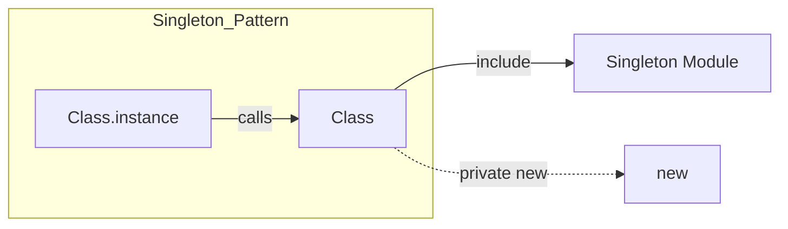

**Summary**

Chapter 12 explains the Singleton pattern, ensuring a class has only one instance and providing a global access point. It shows Ruby’s built-in `Singleton` module and alternative implementations using class variables and private constructors.

**Concepts Map**



**Key Concepts**

* **Singleton** Restricts instantiation to one object.
* **Global Access** Provides a single access method (e.g., `instance`).
* **Singleton Module** Ruby’s `Singleton` mixes in behavior.
* **Private Constructor** Prevents `new` from being called externally.
* **Thread Safety** Consider synchronization when creating instance.

**Quiz 20250622_18:00:00**

1. The Singleton pattern ensures:
- a) Multiple concurrent instances
- b) Only one instance of a class
- c) Many constructors
- d) Dynamic inheritance

2. Ruby’s standard library offers:
- a) Singleton module
- b) Factory module
- c) Builder module
- d) Adapter module

3. After including `Singleton`, you access the object using:
- a) .new
- b) .create
- c) .instance
- d) .get

4. To prevent external instantiation, you:
- a) make `initialize` public
- b) make `new` private
- c) rename class
- d) include `Singleton` twice

5. A drawback of Singleton is:
- a) Global state risks
- b) Thread safety issues
- c) Hidden dependencies
- d) All of the above

6. Thread safety in Singleton can be addressed by:
- a) using Mutex in `instance` method
- b) ignoring concurrent calls
- c) using class variables without locks
- d) forcing single-threaded mode

7. Singleton vs Module: use Singleton when:
- a) you need stateful instance
- b) you need only methods
- c) you prefer mixins
- d) you avoid global access

8. A violation of Singleton occurs if:
- a) calling `instance` multiple times
- b) duplicating object via `dup` or `clone`
- c) including the module
- d) using private constructor

9. Singletons can hinder testing by:
- a) providing global object hard to stub
- b) improving isolation
- c) allowing multiple contexts
- d) isolating state

10. Singleton is most useful for:
- a) value objects
- b) central configuration or logging
- c) data models
- d) ephemeral data

**Answers:**
1. b) Only one instance of a class — core purpose.
2. a) Singleton module — Ruby standard.
3. c) .instance — accessor after include.
4. b) make `new` private — prevents direct creation.
5. d) All of the above — global state, threading, coupling.
6. a) using Mutex in `instance` method — control instantiation.
7. a) you need stateful instance — instance holds state.
8. b) duplicating object via `dup` or `clone` — bypass singleton guarantee.
9. a) providing global object hard to stub — testing difficulty.
10. b) central configuration or logging — single shared resource.

**Challenge**

Implement a thread-safe logger as a singleton with Ruby’s `Singleton` module. Show obtaining instance and logging calls from multiple threads.

**Challenge Answer:**
```ruby
require 'singleton'
class ThreadLogger
  include Singleton
  def initialize; @mutex = Mutex.new; end
  def log(msg)
    @mutex.synchronize { puts "[#{Time.now}] #{msg}" }
  end
end

threads = []
5.times do |i|
  threads << Thread.new { ThreadLogger.instance.log("Msg #{i}") }
end
threads.each(&:join)
```