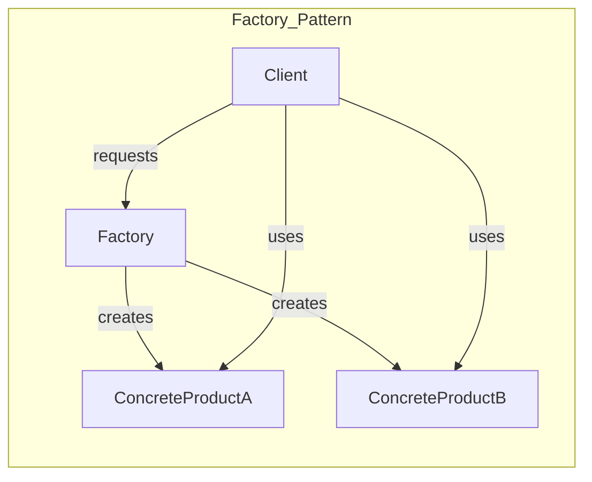

**Summary**

Chapter 13 examines the Factory pattern, which centralizes object creation and hides the instantiation logic from clients. It covers simple factories, factory methods, and abstract factories, demonstrating how Ruby’s dynamic typing and duck typing simplify factory implementations.

**Concepts Map**



**Key Concepts**

* **Factory** Encapsulates object creation logic in a separate class or method.
* **Simple Factory** A static method that returns instances based on parameters.
* **Factory Method** A method in a superclass that subclasses override to instantiate products.
* **Abstract Factory** Provides an interface to create families of related products.
* **Decoupling** Clients depend on abstractions, not concrete classes, improving flexibility.

**Quiz 20250622_18:30:00**

1. The primary goal of the Factory pattern is to:
- a) Simplify inheritance
- b) Encapsulate object creation
- c) Define algorithms
- d) Manage state

2. A simple factory is usually implemented as:
- a) A module mixin
- b) A class method returning different objects
- c) A subclass
- d) A block

3. Factory Method differs from Simple Factory by:
- a) being static vs dynamic
- b) using inheritance and override
- c) using blocks
- d) returning Procs

4. Abstract Factory is used to:
- a) Create independent objects
- b) Create families of related objects
- c) Merge classes
- d) Handle errors

5. In Ruby, duck typing allows factories to:
- a) enforce strict types
- b) return any object responding to the expected methods
- c) require explicit interfaces
- d) avoid inheritance

6. Decoupling in Factory pattern helps to:
- a) increase coupling
- b) hide implementation details from clients
- c) remove abstract classes
- d) force manual instantiation

7. A violation of Factory pattern occurs when:
- a) client calls `new` directly everywhere
- b) using modules
- c) returning nil
- d) using Procs

8. Factory Method is typically defined in:
- a) client code
- b) superclass or interface
- c) modules only
- d) initializer methods

9. Abstract Factory returns:
- a) only one product at a time
- b) a set of related products
- c) strings
- d) classes only

10. Benefits of Factory include:
- a) hiding creation logic
- b) coupling code tightly
- c) removing polymorphism
- d) eliminating modules

**Answers:**
1. b) Encapsulate object creation — centralizes instantiation logic.
2. b) A class method returning different objects — simple factory.
3. b) using inheritance and override — factory method defined in subclass.
4. b) Create families of related objects — abstract factory purpose.
5. b) return any object responding to the expected methods — duck typing.
6. b) hide implementation details from clients — decouples creation.
7. a) client calls `new` directly everywhere — bypasses factory.
8. b) superclass or interface — subclass overrides to create products.
9. b) a set of related products — abstract factory returns multiple.
10. a) hiding creation logic — simplifies client code.

**Challenge**

Implement a `VehicleFactory` that returns `Car` or `Truck` objects based on input. Outline class definitions and show client code using the factory without knowing concrete classes.

**Challenge Answer:**
```ruby
class VehicleFactory
  def self.create(type)
    case type
    when :car then Car.new
    when :truck then Truck.new
    else raise ArgumentError, 'Unknown vehicle'
    end
  end
end
class Car; def drive; 'Car driving'; end; end
class Truck; def drive; 'Truck hauling'; end; end

# Client code:
vehicle = VehicleFactory.create(:car)
puts vehicle.drive # => 'Car driving'
```