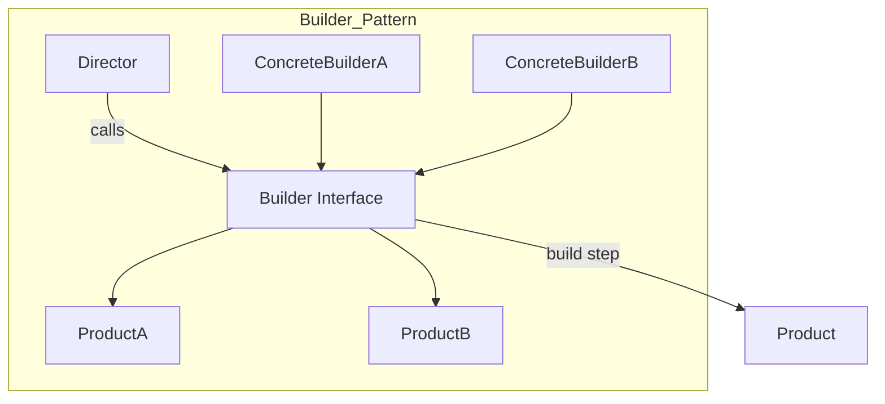

**Summary**

Chapter 14 demonstrates the Builder pattern, which separates the construction of a complex object from its representation. It shows how to use a director to orchestrate step-by-step building and how concrete builders produce different representations of the same process.

**Concepts Map**



**Key Concepts**

* **Builder** Defines abstract interface for creating parts of a product.
* **Concrete Builder** Implements builder interface to construct and assemble parts.
* **Director** Controls the building sequence using a builder.
* **Product** The final complex object composed of parts.
* **Fluent Interface** Builder methods can return self for chaining.

**Quiz 20250622_19:00:00**

1. The Builder pattern is used to:
- a) Compose objects at runtime
- b) Separate construction and representation of complex objects
- c) Control object access
- d) Define algorithms

2. In Builder, the Director:
- a) Implements build steps
- b) Manages product parts assembly sequence
- c) Stores final object
- d) Delegates to subclasses

3. A Concrete Builder is responsible for:
- a) Directing the sequence
- b) Defining product structure and parts
- c) Acting as a product itself
- d) Cleaning up resources

4. Products are assembled by:
- a) Director only
- b) Builder implementation
- c) Client code using new
- d) Composition pattern

5. Fluent interfaces help by:
- a) hiding methods
- b) chaining builder calls
- c) eliminating directors
- d) implementing callbacks

6. A violation of Builder occurs if:
- a) direct `new` is used without builder
- b) using method_missing
- c) product is immutable
- d) director is stateless

7. Builder improves code by:
- a) coupling construction logic to product
- b) isolating construction steps
- c) removing interfaces
- d) forcing inheritance

8. You can create multiple representations by:
- a) using different concrete builders
- b) changing director code
- c) monkey-patching product
- d) subclassing director

9. Director and Builder are decoupled by:
- a) shared state
- b) builder interface abstraction
- c) global variables
- d) static methods

10. Builder is most useful when:
- a) objects are simple
- b) object creation involves many steps and variants
- c) only one representation exists
- d) using inheritance only

**Answers:**
1. b) Separate construction and representation of complex objects.
2. b) Manages product parts assembly sequence.
3. b) Defining product structure and parts.
4. b) Builder implementation assembles product.
5. b) chaining builder calls.
6. a) direct `new` is used without builder — bypasses pattern.
7. b) isolating construction steps.
8. a) using different concrete builders.
9. b) builder interface abstraction.
10. b) object creation involves many steps and variants.

**Challenge**

Implement a `HtmlBuilder` and `JsonBuilder` for constructing documents with `add_title`, `add_paragraph`, `render`. Use a director to build a standard report.

**Challenge Answer:**
```ruby
class ReportDirector
  def initialize(builder); @b = builder; end
  def construct
    @b.add_title('Report Title')
    @b.add_paragraph('First section')
    @b.add_paragraph('Conclusion')
    @b.result
  end
end
class HtmlBuilder
  def initialize; @doc = []; end
  def add_title(t); @doc << "<h1>#{t}</h1>"; self; end
  def add_paragraph(p); @doc << "<p>#{p}</p>"; self; end
  def result; @doc.join("\n"); end
end
class JsonBuilder
  def initialize; @o = { title: '', paragraphs: [] }; end
  def add_title(t); @o[:title] = t; self; end
  def add_paragraph(p); @o[:paragraphs] << p; self; end
  def result; JSON.generate(@o); end
end

# Usage:
d = ReportDirector.new(HtmlBuilder.new)
puts d.construct
```