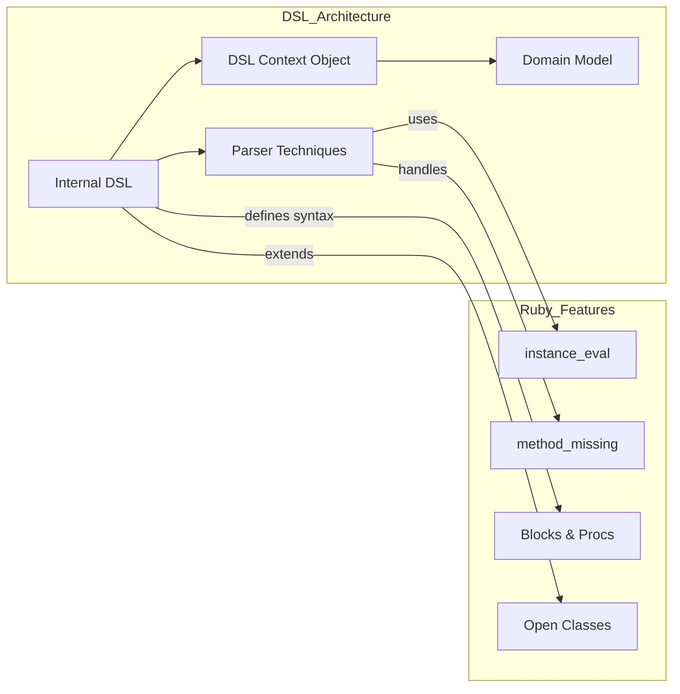

**Summary**

Chapter 16 explores Domain-Specific Languages (DSLs) in Ruby, showing how internal DSLs leverage Ruby’s syntax flexibility to create expressive mini-languages within code. It covers parsing techniques, context objects, and using `instance_eval`, `method_missing`, and blocks to craft readable DSLs that encapsulate domain concepts.

**Concepts Map**



**Key Concepts**

* **Domain-Specific Language (DSL)** A mini-language tailored to a specific problem domain.
* **Internal DSL** Builds DSL within Ruby using Ruby syntax and metaprogramming.
* **Parser Techniques** Using `instance_eval` and `method_missing` to interpret DSL statements.
* **Context Object** Holds state and methods that DSL code runs against.
* **Readable Syntax** Designing method names and block structures for clarity.

**Quiz 20250622_20:30:00**

1. An internal DSL in Ruby typically uses:
- a) external parser generators
- b) Ruby’s own syntax and metaprogramming
- c) XML configuration files
- d) YAML templates

2. The `instance_eval` method is used to:
- a) Evaluate code in global scope
- b) Change an object’s singleton class
- c) Execute DSL code in a specific context object
- d) Define new classes

3. `method_missing` helps DSLs by:
- a) Caching method calls
- b) Handling unknown method calls as DSL keywords
- c) Overriding class methods only
- d) Preventing runtime errors

4. A Context Object in DSL design:
- a) Parses text files
- b) Stores shared state and defines DSL methods
- c) Generates HTML output
- d) Manages threads

5. Blocks & Procs in DSLs allow:
- a) Static code only
- b) Nesting and grouping of DSL statements
- c) Automatic validation
- d) File I/O operations

6. Open Classes enable DSLs to:
- a) Prevent modifications
- b) Extend core classes with new DSL methods
- c) Lock method definitions
- d) Create new modules only

7. A violation of DSL design is when:
- a) DSL syntax is ambiguous or hard to read
- b) using `instance_eval`
- c) defining context classes
- d) using blocks

8. Domain Model in a DSL:
- a) Is independent of DSL code
- b) Represents business concepts mapped by DSL
- c) Handles database migrations
- d) Encrypts data

9. DSL readability improves by:
- a) choosing long, technical method names
- b) matching domain terminology in method names
- c) minimizing context objects
- d) avoiding blocks

10. The primary benefit of DSLs is:
- a) General-purpose programming
- b) Expressiveness and lowered boilerplate for domain tasks
- c) Increased boilerplate
- d) Static typing

**Answers:**
1. b) Ruby’s own syntax and metaprogramming — internal DSL.
2. c) Execute DSL code in a specific context object — `instance_eval` role.
3. b) Handling unknown method calls as DSL keywords — dynamic parsing.
4. b) Stores shared state and defines DSL methods — context pattern.
5. b) Nesting and grouping of DSL statements — block syntax.
6. b) Extend core classes with new DSL methods — open class usage.
7. a) DSL syntax is ambiguous or hard to read — readability violation.
8. b) Represents business concepts mapped by DSL — domain mapping.
9. b) matching domain terminology in method names — clarity.
10. b) Expressiveness and lowered boilerplate for domain tasks — key advantage.

**Challenge**

Create a simple internal DSL for defining HTML structures: allow constructs like `html { head { title 'My Page' } body { p 'Hello, world' } }`. Show DSL class, context, and example usage.

**Challenge Answer:**
```ruby
class HtmlBuilder
  def initialize; @output = ''; end
  def html(&block); instance_eval(&block); @output; end
  def head(&block); @output << '<head>'; instance_eval(&block); @output << '</head>'; end
  def title(text); @output << "<title>#{text}</title>"; end
  def body(&block); @output << '<body>'; instance_eval(&block); @output << '</body>'; end
  def p(text); @output << "<p>#{text}</p>"; end
end

puts HtmlBuilder.new.html do
  head { title 'My Page' }
  body { p 'Hello, world' }
end
```