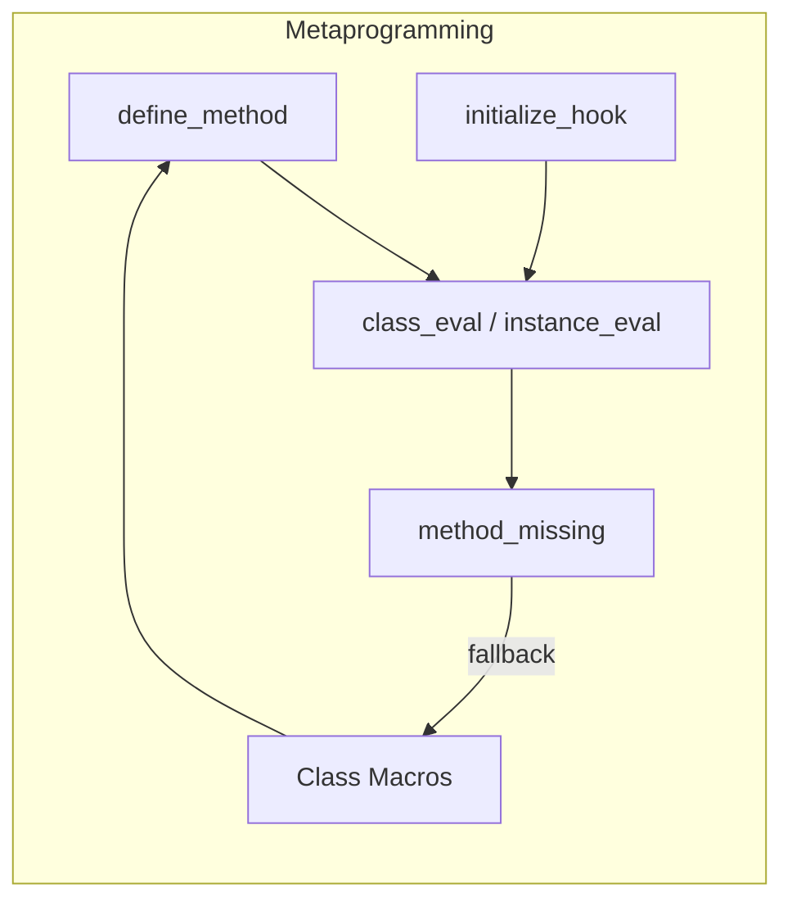

**Summary**

Chapter 17 explores Ruby metaprogramming techniques for crafting custom objects and behavior dynamically. It covers defining methods at runtime with `define_method`, using `class_eval` and `instance_eval` to inject code, leveraging `method_missing` for proxies and DSLs, and creating class macros and hooks to reduce boilerplate.

**Concepts Map**



**Key Concepts**

* **define_method** Creates instance methods dynamically at runtime.
* **class_eval / instance_eval** Evaluate code in the context of a class or object.
* **method_missing** Intercept undefined method calls to implement dynamic proxies or DSLs.
* **Class Macros** Custom class methods (e.g., `attr_accessor`) for DSL-like configuration.
* **Reflection** Inspect classes, methods, and constants with methods like `methods`, `const_get`.

**Quiz 20250622_21:00:00**

1. Which method defines new methods at runtime?
- a) method_missing
- b) define_method
- c) class_eval
- d) instance_eval

2. `class_eval` differs from `instance_eval` by:
- a) evaluating in instance context vs class context
- b) requiring a block
- c) defining singleton methods
- d) never modifying state

3. `method_missing` is commonly used to:
- a) raise errors on undefined calls
- b) forward calls to another object or generate methods on-the-fly
- c) list methods
- d) lock down classes

4. Class Macros in Ruby often use:
- a) `define_method` and blocks
- b) `method_missing`
- c) global variables
- d) private inheritance

5. Reflection allows you to:
- a) modify strings only
- b) inspect and access classes, constants, and methods at runtime
- c) prevent method creation
- d) perform I/O

6. A violation of Ruby metaprogramming best practices is:
- a) using `define_method` sparingly
- b) excessive reliance on `eval`
- c) writing clear tests
- d) using `const_get`

7. Class hooks like `inherited` let you:
- a) run custom code when a subclass is created
- b) define new modules
- c) freeze classes
- d) mark methods private

8. A proxy implemented via `method_missing` can:
- a) call only existing methods
- b) forward any call to an inner object
- c) prevent delegation
- d) enforce static types

9. Macros reduce boilerplate by:
- a) generating repetitive methods automatically
- b) requiring manual definitions
- c) disabling dynamic features
- d) using constants only

10. To inspect all instance methods of an object, you call:
- a) `methods`
- b) `instance_variables`
- c) `respond_to?`
- d) `method_missing`

**Answers:**
1. b) define_method — dynamically defines methods.
2. a) evaluating in class context vs instance context — class vs object.
3. b) forward calls or generate methods on-the-fly — dynamic handling.
4. a) `define_method` and blocks — typical macro implementation.
5. b) inspect classes, constants, methods at runtime — reflection role.
6. b) excessive reliance on `eval` — can introduce security and maintenance issues.
7. a) run custom code when a subclass is created — `inherited` hook.
8. b) forward any call to an inner object — proxy pattern via method_missing.
9. a) generating repetitive methods automatically — macro benefit.
10. a) `methods` — returns method list.

**Challenge**

Create a `Settings` class that dynamically defines getters and setters for configuration keys provided in a hash using `define_method`. Show class definition and usage with sample keys.

**Challenge Answer:**
```ruby
class Settings
  def initialize(config)
    config.each do |key, value|
      define_singleton_method(key) { @config[key] }
      define_singleton_method("#{key}=") { |v| @config[key] = v }
    end
    @config = config
  end
end

settings = Settings.new(db: 'sqlite', cache: true)
puts settings.db      # 'sqlite'
settings.cache = false
```