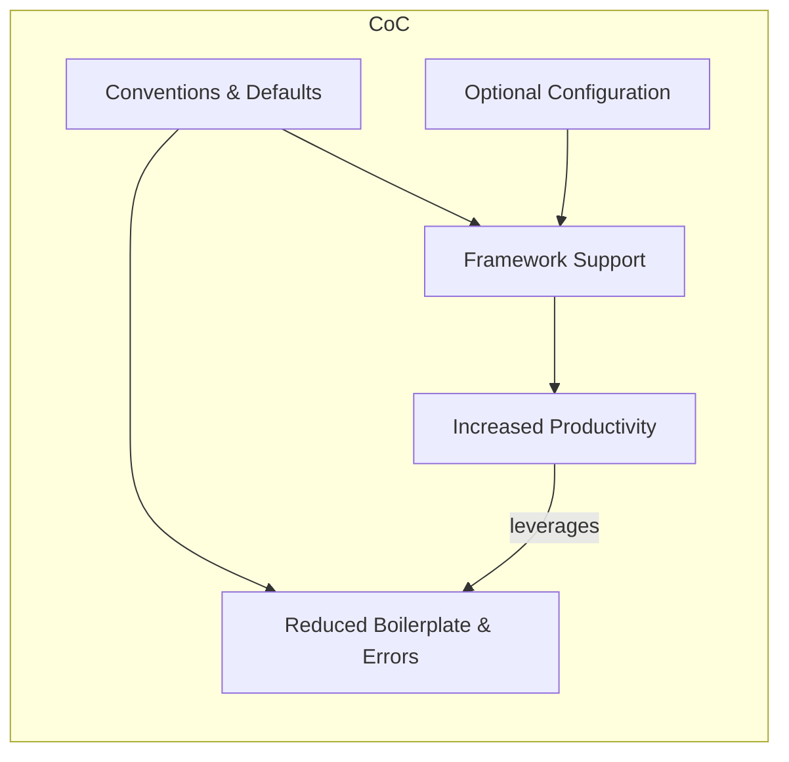

**Summary**

Chapter 18 demonstrates the principle of Convention Over Configuration, where frameworks adopt sensible defaults and naming conventions to reduce explicit configuration. By following agreed-upon patterns for file structure, naming, and interfaces, developers write less boilerplate and achieve faster development with fewer errors.

**Concepts Map**



**Key Concepts**

* **Convention Over Configuration** Relies on default behaviors and naming to minimize setup.
* **Sensible Defaults** Predefined settings that work out of the box.
* **Optional Overrides** Configuration only when deviating from conventions.
* **File and Naming Conventions** Directory layout, class and method names guide automatic wiring.
* **Boilerplate Reduction** Less code to write and maintain, fewer typos and mismatches.
* **Framework Integration** Many Ruby frameworks (e.g., Rails) embrace this principle.

**Quiz 20250622_22:00:00**

1. Convention Over Configuration primarily reduces:
- a) Runtime speed
- b) Boilerplate code
- c) Compilation time
- d) Memory usage

2. Sensible defaults allow developers to:
- a) Write configurations for every component
- b) Use frameworks without extensive setup
- c) Ignore naming conventions
- d) Hardcode paths everywhere

3. When you need behavior different from the convention, you:
- a) Fork the framework
- b) Write explicit configuration only for that case
- c) Rename all files
- d) Reconfigure defaults globally

4. Naming conventions in a framework enable:
- a) Automatic class and file loading
- b) Manual registry of classes
- c) Performance tuning
- d) Dynamic typing

5. A drawback of relying on conventions is:
- a) Increased boilerplate
- b) Steep learning curve for framework conventions
- c) Slower development
- d) More typos

6. Frameworks like Rails use CoC to:
- a) enforce strict typing
- b) auto-load controllers, models, views by directory structure
- c) require manual routing only
- d) disable default behaviors

7. Overriding a default route in Rails requires:
- a) no action
- b) adding a configuration file or explicit route entry
- c) renaming controllers
- d) using a class macro

8. CoC improves team collaboration by:
- a) allowing everyone to configure differently
- b) ensuring consistent project structure
- c) hiding code completely
- d) reducing documentation

9. A violation of CoC occurs if:
- a) you follow file naming guidelines
- b) you configure every small detail explicitly
- c) you use defaults
- d) you use documented conventions

10. The ultimate benefit of CoC is:
- a) greater flexibility at the cost of complexity
- b) less cognitive load and faster setup
- c) more configuration files
- d) slower onboarding

**Answers:**
1. b) Boilerplate code — reduces repetitive setup.
2. b) Use frameworks without extensive setup — defaults cover common cases.
3. b) Write explicit configuration only for that case — override when needed.
4. a) Automatic class and file loading — conventions drive autoload.
5. b) Steep learning curve for framework conventions — must learn defaults.
6. b) auto-load controllers, models, views by directory structure — Rails example.
7. b) adding a configuration file or explicit route entry — override convention.
8. b) ensuring consistent project structure — team alignment.
9. b) you configure every small detail explicitly — unnecessary config.
10. b) less cognitive load and faster setup — key advantage.

**Challenge**

Design a simple web app structure following Convention Over Configuration: outline directories (`controllers/`, `models/`, `views/`) and how default naming maps to routes and classes. Explain how framework uses these conventions to wire components without manual config.

**Challenge Answer:**
Define folder structure:
```
app/
  controllers/
    users_controller.rb   # class UsersController
  models/
    user.rb               # class User
  views/
    users/index.html.erb  # view for UsersController#index
```
Framework inspects `app/controllers/users_controller.rb`, infers route `/users` maps to `UsersController#index`, auto-loads `User` model, and renders `views/users/index.html.erb` by convention. Explicit configuration is needed only for nonstandard routes or file names.