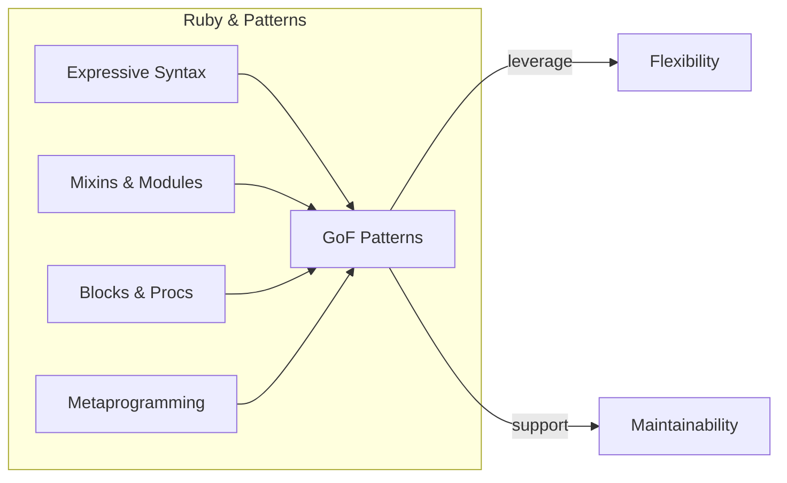

**Summary**

The final chapter wraps up by reinforcing how Ruby’s expressive syntax and metaprogramming capabilities make implementing classical design patterns both concise and powerful. It reviews key lessons: isolating change, designing for flexibility, leveraging blocks and modules, and favoring composition. The conclusion encourages readers to apply patterns judiciously, guided by Ruby idioms.

**Concepts Map**

**Key Concepts**

* **Ruby Idioms** Use blocks, mixins, and dynamic methods to implement patterns succinctly.
* **Selective Application** Choose patterns only when they solve real design problems.
* **Composition & Delegation** Prefer combining objects over deep inheritance.
* **Metaprogramming** Dynamically define behavior to reduce boilerplate.
* **Testing Patterns** Validate each pattern implementation with targeted tests.
* **Continuous Learning** Patterns evolve—adapt best practices to new problems.

**Quiz 20250622_22:30:00**

1. Ruby’s dynamic features help implement patterns by:
- a) Forcing static types
- b) Allowing runtime method creation
- c) Preventing meta techniques
- d) Disabling blocks

2. The recommended alternative to deep inheritance is:
- a) Global variables
- b) Composition and delegation
- c) Class variables
- d) Inheritance chains

3. Metaprogramming reduces boilerplate by:
- a) writing code manually
- b) generating methods and classes at runtime
- c) preventing dynamic features
- d) blocking method_missing

4. Testing design patterns ensures:
- a) only syntax correctness
- b) correct behavior for each variation
- c) runtime errors only
- d) no need for refactoring

5. Applying patterns judiciously means:
- a) using every pattern in all code
- b) selecting patterns that address actual problems
- c) avoiding patterns entirely
- d) following patterns blindly

6. Mixins are best used to:
- a) inherit behavior only
- b) share functionality among classes
- c) override core classes always
- d) define global variables

7. Blocks and Procs facilitate patterns by:
- a) eliminating objects
- b) encapsulating behavior and callbacks
- c) enforcing interfaces
- d) preventing closures

8. A major benefit of composition is:
- a) tighter coupling
- b) easier swapping of components
- c) deeper class hierarchies
- d) global access

9. Continuous learning of patterns helps to:
- a) write outdated code
- b) adapt solutions to new problems
- c) ignore Ruby features
- d) overgeneralize designs

10. The ultimate aim of design patterns is to:
- a) complicate codebases
- b) improve flexibility, maintainability, and clarity
- c) enforce strict paradigms
- d) remove dynamic behavior

**Answers:**
1. b) Allowing runtime method creation — dynamic Ruby features.
2. b) Composition and delegation — favor object composition.
3. b) generating methods and classes at runtime — metaprogramming benefit.
4. b) correct behavior for each variation — tests validate pattern.
5. b) selecting patterns that address actual problems — pragmatic use.
6. b) share functionality among classes — mixin purpose.
7. b) encapsulating behavior and callbacks — blocks and Procs roles.
8. b) easier swapping of components — composition flexibility.
9. b) adapt solutions to new problems — evolving best practices.
10. b) improve flexibility, maintainability, and clarity — pattern goals.

**Challenge**

Design a simple text processing pipeline in Ruby that uses Strategy for tokenization, Observer for logging events, Decorator for augmenting tokens (e.g., uppercase), and Builder to assemble a final report. Outline class and object interactions and explain how each pattern contributes.

**Challenge Answer:**

- Tokenizer strategies (`WhitespaceStrategy`, `RegexStrategy`) implement `tokenize(text)`.
- `Logger` subject notifies observers on each processing step; observers log to console or file.
- `TokenDecorator` wraps token objects to add behavior like transforming text.
- `ReportBuilder` gathers processed tokens, builds a summary report via chained method calls.

This pipeline uses Strategy to swap tokenizers, Observer to decouple logging, Decorator to extend token behavior dynamically, and Builder to construct the final report with minimal coupling.